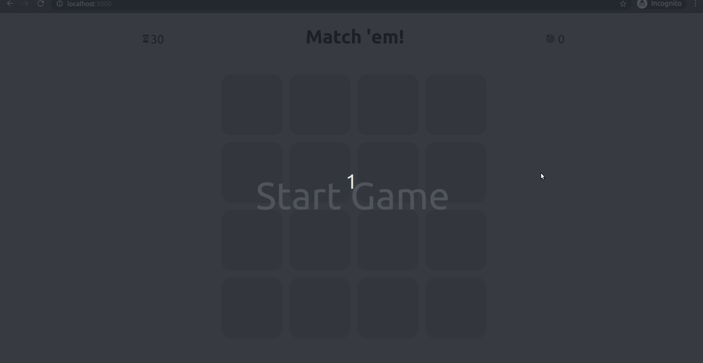

# :hearts: Match 'em! :spades:

## Introduction

This is a match'em game for TypeScript practice purpose.

## Table of Contents

- **[Introduction](#introduction)**
- **[Main Functions](#main-functions)**
- **[Technologies Used](#technologies-used)**

## Main Functions

- Card flip animation, card suits match checking and scoring.
- Accurate countdown timer.

## Technologies Used

- TypeScript
- React Hooks

The frontend was scaffolded using the vue-create cli. [See the standard create-react docs](./create-react-app-docs.md).
